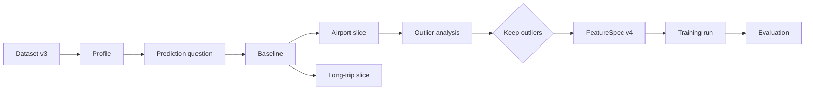

Yes — I’d give Broadway a **run graph / decision map** that is generated from the artifacts you already persist.

Think of it as:

```text
DatasetRef
   ↓
DatasetProfile
   ↓
AnalysisContract
   ↓
BaselineResult
   ↓
DatasetSlice(s)
   ↓
Diagnostics / Feature experiments
   ↓
DecisionRecord(s)
   ↓
FeatureSpec
   ↓
TrainingResult
   ↓
EvaluationResult
   ↓
Champion / inference
```

Each node should be clickable/inspectable and show:

* status
* artifact path
* dataset/slice used
* config/contract
* decision taken
* reason/evidence
* upstream/downstream links

The key is: **don’t hand-maintain the diagram. Generate it from lineage.**

I’d add a tiny generic model such as:

```python
class LineageNode(BaseModel):
    id: str
    kind: str
    label: str
    artifact: str | None
    status: str

class LineageEdge(BaseModel):
    source: str
    target: str
    relation: str
```

Then every result/decision registers its parents. Broadway can render that into Mermaid initially:



That alone would be very useful in README/report artifacts.

Later, a small web UI could give you three views:

**Pipeline view** — where am I in the lifecycle?
**Decision view** — what choices have I made and why?
**Lineage view** — which dataset/results led to this model or conclusion?

I’d also add an explicit run state:

```text
CURRENT GOAL
Predict trip duration at pickup

CURRENT STAGE
Feature validation

OPEN DECISIONS
- treatment of extreme trip distances
- passenger_count missingness

RESOLVED
✓ target defined
✓ decision moment defined
✓ leakage columns excluded
✓ baseline established
```

That may be even more useful than a fancy DAG because it tells the analyst **what remains unresolved**.

So I’d build this in two steps: first generate `artifacts/lineage/graph.json` + Mermaid from existing artifacts, then later add an interactive UI if it proves valuable.


where the data came from
→ what was observed
→ what question was asked
→ what analyses were run
→ what slices were examined
→ what decisions were made
→ why they were made
→ what features/model resulted
→ what was promoted