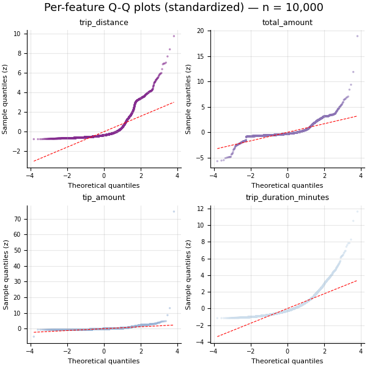
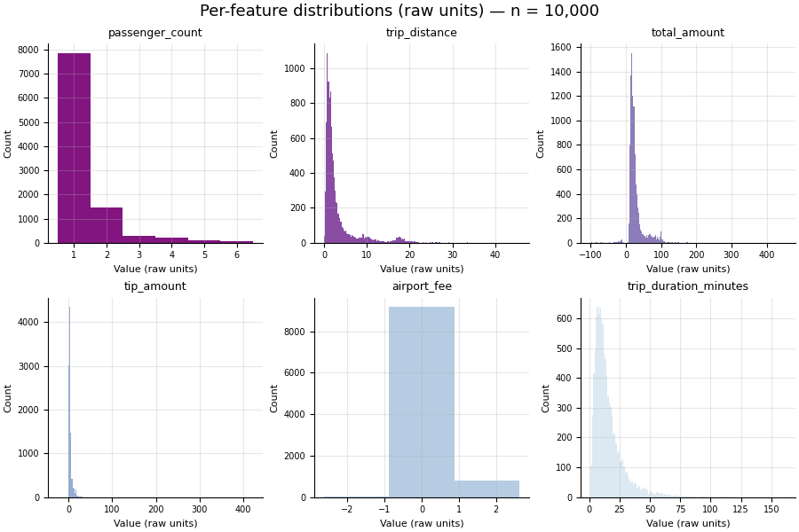

# Dataset Profile

## Answer

The dataset has 8545833 rows and 9 columns.

## Key evidence

### Variables

| Variable | Type | Missing | Unique | Min | Max |
| --- | --- | --- | --- | --- | --- |
| pickup_datetime | datetime64[ns] | 0 | 4584079 | 2024-01-01T00:00:00 | 2024-04-01T00:34:55 |
| passenger_count | float64 | 0 | 6 | 1.0 | 6.0 |
| trip_distance | float64 | 0 | 4658 | 0.01 | 49.99 |
| pickup_location_id | int32 | 0 | 257 | 1 | 265 |
| dropoff_location_id | int32 | 0 | 261 | 1 | 265 |
| total_amount | float64 | 0 | 23975 | -1000.0 | 1021.99 |
| tip_amount | float64 | 0 | 5132 | -300.0 | 999.99 |
| airport_fee | float64 | 0 | 3 | -1.75 | 1.75 |
| trip_duration_minutes | float64 | 0 | 8721 | 1.0 | 179.71666666666667 |

### Potentially important observations

none

## Profile evidence

Traces are per-feature z-score.
Sample size: n = 10,000

In this figure: trip_distance, total_amount, tip_amount, trip_duration_minutes. Chunk 1 of 1; the trailing `_1` in the filename is the chunk number.

How to read (Q-Q): points should follow the fitted reference line; S-curves indicate tail behavior; curvature indicates skew.

Histograms are in raw units.

In this figure: passenger_count, trip_distance, total_amount, tip_amount, airport_fee, trip_duration_minutes. Chunk 1 of 1; the trailing `_1` in the filename is the chunk number.

How to read (distribution): actual spread and skew in original units; look for heavy tails, multimodality, and gaps.

Notes:
- pickup_location_id: declared id
- dropoff_location_id: declared id
- passenger_count: discrete (6 unique values) (excluded from Q-Q, kept as a bar chart in the distribution grid)
- airport_fee: discrete (3 unique values) (excluded from Q-Q, kept as a bar chart in the distribution grid)
- not profiled (non-numeric): pickup_datetime

## Why this may matter

High-cardinality/identifier-like columns can inflate group counts or leak identity if used as grouping features.

## What Broadway did not decide

Broadway did not exclude or transform any column based on this profile.

## Technical details

artifacts/discover/profile.json
