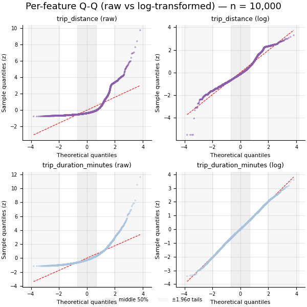
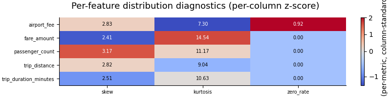

# Dataset Profile

## Answer

The dataset has 8545833 rows and 9 columns.

## Key evidence

### Variables

| Variable | Type | Missing | Unique | Min | Max |
| --- | --- | --- | --- | --- | --- |
| pickup_datetime | datetime64[ns] | 0 | 4584079 | 2024-01-01T00:00:00 | 2024-04-01T00:34:55 |
| passenger_count | float64 | 0 | 6 | 1.0 | 6.0 |
| trip_distance | float64 | 0 | 4658 | 0.01 | 49.99 |
| pickup_location_id | int32 | 0 | 257 | 1 | 265 |
| dropoff_location_id | int32 | 0 | 261 | 1 | 265 |
| total_amount | float64 | 0 | 23975 | -1000.0 | 1021.99 |
| tip_amount | float64 | 0 | 5132 | -300.0 | 999.99 |
| airport_fee | float64 | 0 | 3 | -1.75 | 1.75 |
| trip_duration_minutes | float64 | 0 | 8721 | 1.0 | 179.71666666666667 |

### Potentially important observations

none

## Profile evidence

Traces are per-feature z-score.
Sample size: n = 10,000

In this figure: trip_distance, total_amount, tip_amount, trip_duration_minutes. Chunk 1 of 1; the trailing `_1` in the filename is the chunk number.

How to read (Q-Q): points should follow the fitted reference line; S-curves indicate tail behavior; curvature indicates skew. Shaded bands mark the middle 50% (centre) and the ±1.96σ tails; the red dashed horizontal line is the zero-mass shelf (a flat clump of dots = a spike of exact zeros).

In this figure: trip_distance, trip_duration_minutes. Chunk 1 of 1; the trailing `_1` in the filename is the chunk number.

How to read (raw vs log): the skewed, strictly-positive features re-plotted after a log transform; compare raw (left) to log (right) — if the right tail straightens toward the reference line, logging is a viable remediation.

Histograms are in raw units.

In this figure: passenger_count, trip_distance, total_amount, tip_amount, airport_fee, trip_duration_minutes. Chunk 1 of 1; the trailing `_1` in the filename is the chunk number.

How to read (distribution): actual spread and skew in original units; look for heavy tails, multimodality, and gaps.

### Distribution diagnostics

| Variable | n | mean | std | skew | excess_kurtosis | zero_rate | p99/median | max/median | log_skew |
| --- | --- | --- | --- | --- | --- | --- | --- | --- | --- |
| passenger_count | 10000 | 1.35 | 0.832 | 3.17 | 11.2 | 0.000 | 5 | 6 | 2.05 |
| trip_distance | 10000 | 3.31 | 4.35 | 2.82 | 9.04 | 0.000 | 11.8 | 26.8 | 0.528 |
| total_amount | 10000 | 27 | 22.5 | 2.71 | 21.8 | 0.000 | 5.1 | 22.5 | - |
| tip_amount | 10000 | 3.47 | 5.62 | 42.4 | 3.1e+03 | 0.218 | 6.01 | 148 | - |
| airport_fee | 10000 | 0.139 | 0.486 | 2.83 | 7.3 | 0.917 | - | - | - |
| trip_duration_minutes | 10000 | 15.5 | 12.6 | 2.51 | 10.6 | 0.000 | 5.31 | 13.6 | -0.0499 |

In this figure: passenger_count, trip_distance, total_amount, tip_amount, airport_fee, trip_duration_minutes. Chunk 1 of 1; the trailing `_1` in the filename is the chunk number.

How to read (diagnostics): colors are per-column z-scores; cell text is the raw value.

### Decision flags

- passenger_count: skew 3.17 exceeds 1.0
- passenger_count: kurtosis 11.17 exceeds 3.0
- trip_distance: skew 2.82 exceeds 1.0
- trip_distance: kurtosis 9.04 exceeds 3.0
- total_amount: skew 2.71 exceeds 1.0
- total_amount: kurtosis 21.78 exceeds 3.0
- tip_amount: zero_rate 0.218 exceeds 0.05
- tip_amount: skew 42.43 exceeds 1.0
- tip_amount: kurtosis 3103.29 exceeds 3.0
- tip_amount: max/p99 ratio 24.6 exceeds 10.0
- airport_fee: zero_rate 0.917 exceeds 0.05
- airport_fee: skew 2.83 exceeds 1.0
- airport_fee: kurtosis 7.30 exceeds 3.0
- trip_duration_minutes: skew 2.51 exceeds 1.0
- trip_duration_minutes: kurtosis 10.63 exceeds 3.0

Notes:
- pickup_location_id: declared id
- dropoff_location_id: declared id
- passenger_count: discrete (6 unique values) (excluded from Q-Q, kept as a bar chart in the distribution grid)
- airport_fee: discrete (3 unique values) (excluded from Q-Q, kept as a bar chart in the distribution grid)
- not profiled (non-numeric): pickup_datetime

## Why this may matter

High-cardinality/identifier-like columns can inflate group counts or leak identity if used as grouping features.

## What Broadway did not decide

Broadway did not exclude or transform any column based on this profile.

## Technical details

artifacts/discover/profile.json
