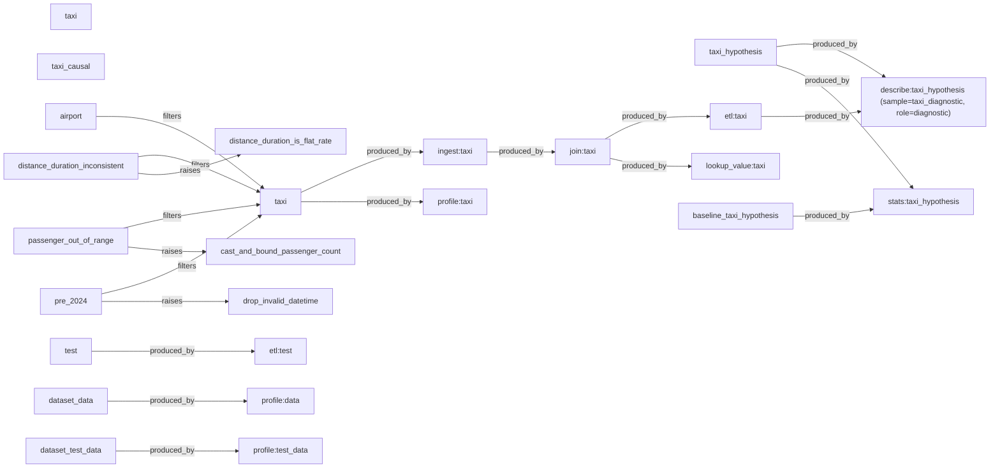

```mermaid
flowchart LR
    analysis_taxi["taxi"]
    analysis_taxi_causal["taxi_causal"]
    analysis_taxi_hypothesis["taxi_hypothesis"]
    dataset_taxi["taxi"]
    dataset_test["test"]
    decision_cast_and_bound_passenger_count["cast_and_bound_passenger_count"]
    decision_distance_duration_is_flat_rate["distance_duration_is_flat_rate"]
    decision_drop_invalid_datetime["drop_invalid_datetime"]
    describe_taxi_hypothesis["describe:taxi_hypothesis (sample=taxi_diagnostic, role=diagnostic)"]
    etl_taxi["etl:taxi"]
    etl_test["etl:test"]
    ingest_taxi["ingest:taxi"]
    join_taxi["join:taxi"]
    lookup_value_taxi["lookup_value:taxi"]
    profile_data["profile:data"]
    profile_taxi["profile:taxi"]
    profile_test_data["profile:test_data"]
    slice_airport["airport"]
    slice_distance_duration_inconsistent["distance_duration_inconsistent"]
    slice_passenger_out_of_range["passenger_out_of_range"]
    slice_pre_2024["pre_2024"]
    stats_taxi_hypothesis["stats:taxi_hypothesis"]
    analysis_taxi_hypothesis -->|produced_by| describe_taxi_hypothesis
    analysis_taxi_hypothesis -->|produced_by| stats_taxi_hypothesis
    baseline_taxi_hypothesis -->|produced_by| stats_taxi_hypothesis
    dataset_data -->|produced_by| profile_data
    dataset_taxi -->|produced_by| ingest_taxi
    dataset_taxi -->|produced_by| profile_taxi
    dataset_test -->|produced_by| etl_test
    dataset_test_data -->|produced_by| profile_test_data
    etl_taxi -->|produced_by| describe_taxi_hypothesis
    ingest_taxi -->|produced_by| join_taxi
    join_taxi -->|produced_by| etl_taxi
    join_taxi -->|produced_by| lookup_value_taxi
    slice_airport -->|filters| dataset_taxi
    slice_distance_duration_inconsistent -->|filters| dataset_taxi
    slice_distance_duration_inconsistent -->|raises| decision_distance_duration_is_flat_rate
    slice_passenger_out_of_range -->|filters| dataset_taxi
    slice_passenger_out_of_range -->|raises| decision_cast_and_bound_passenger_count
    slice_pre_2024 -->|filters| dataset_taxi
    slice_pre_2024 -->|raises| decision_drop_invalid_datetime
```
