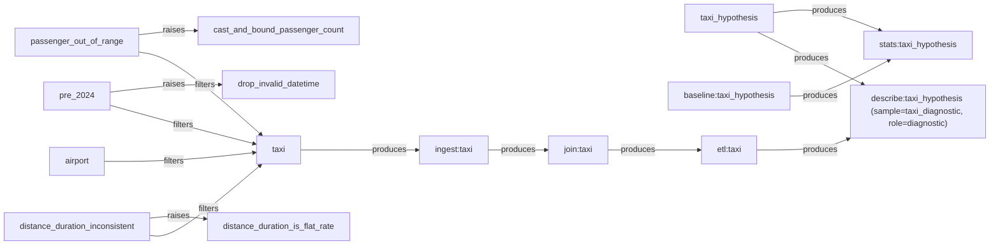

# Lineage — taxi_hypothesis

This graph shows how the evidence and results for this analysis were produced.

Read arrows left-to-right:

parent --produces--> child

Special relationships:

- filters -> a slice restricts its parent dataset
- raises -> evidence raised an analytical decision
- referenced_not_found -> a node references this parent, but no persisted lineage record was found

