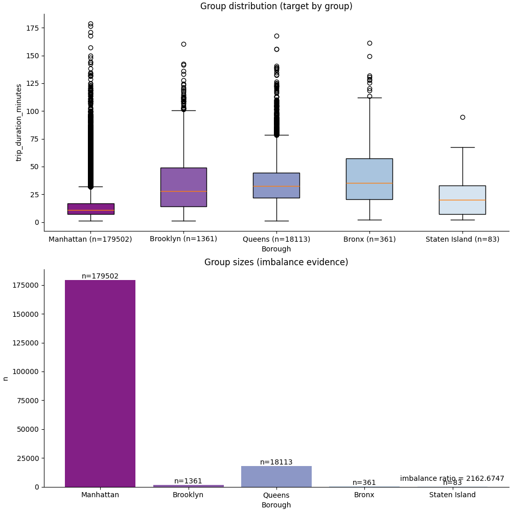

# Describe groups

## Question

Do the groups contain enough observations?

## What was run

describe

## What it found

- imbalance_ratio: 2.16e+03
- absent_groups: 0
- n_total: 200130
- n_used: 199420
- n_excluded: 710
- exclusion_reason: unlisted group (values outside the configured group list; see audit)

## Why it matters

group sizes are imbalanced (imbalance ratio 2.16e+03).

## Attrition

N used 199420 of 200130 (710 excluded: unlisted group (values outside the configured group list; see audit)); see audit

## Figures

