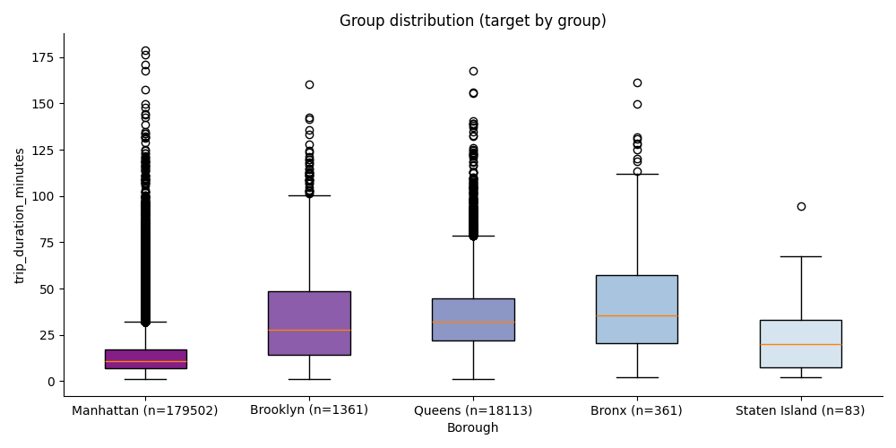
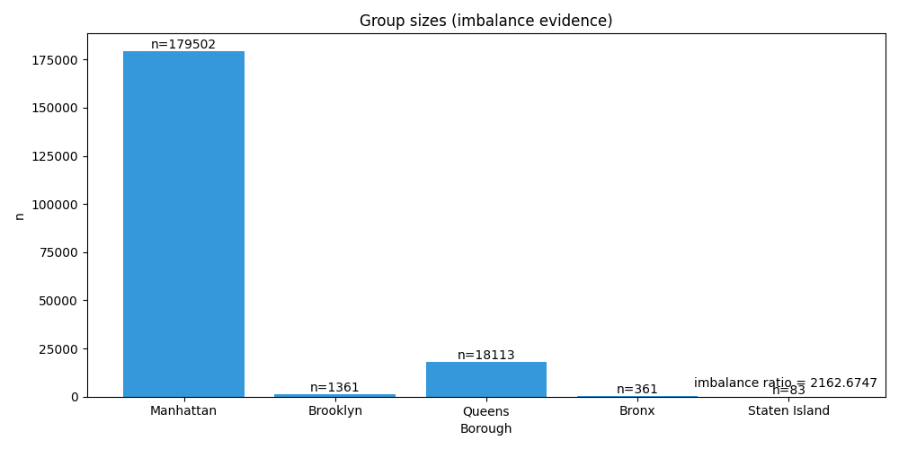
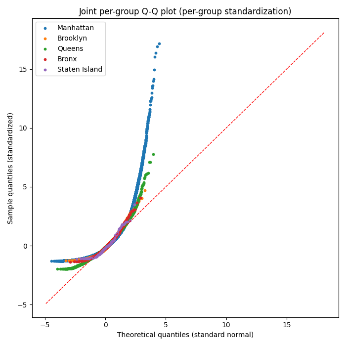

# Timeline — taxi_hypothesis

| # | Step | Question | Status |
| --- | --- | --- | --- |
| 1 | Describe groups | Do the groups contain enough observations? | completed with note |
| 2 | Normality diagnostics | Is the distributional shape problematic? | completed with note |
| 3 | Variance homogeneity | Is error/group variance homogeneous? | warning |
| 4 | Choose principal method | Which principal method should answer the question? | completed |
| 5 | Principal analysis | Do the group means differ? | completed with note |
| 6 | Choose post-hoc method | Which post-hoc comparison is appropriate? | completed |
| 7 | Post-hoc comparisons | Which specific group pairs differ? | completed |
| 8 | Conclusion | What is the conclusion? | completed |

## Describe groups

- ramification: group sizes are imbalanced (imbalance ratio 2162.6747).
- evidence_refs: describe.json
- result_summary:
  - total_n: 200130
  - imbalance_ratio: 2.16e+03
  - absent_groups: 0
  - n_total: 200130
  - n_used: 199420
  - n_excluded: 710
  - exclusion_reason: unlisted group
  - N used 199420 of 200130 (710 excluded: unlisted group); see audit

## Normality diagnostics

- ramification: distributional shape is skewed/heavy-tailed in some groups; consider this alongside sample size before choosing a method.
- evidence_refs: normality.json
- result_summary:
  - Manhattan.skew: 2.61
  - Manhattan.kurtosis: 13
  - Manhattan.shapiro_p: < 0.001
  - Brooklyn.skew: 1.2
  - Brooklyn.kurtosis: 1.24
  - Brooklyn.shapiro_p: < 0.001
  - Queens.skew: 0.841
  - Queens.kurtosis: 1.52
  - Queens.shapiro_p: < 0.001
  - Bronx.skew: 1.14
  - Bronx.kurtosis: 1.22
  - Bronx.shapiro_p: < 0.001
  - Staten Island.skew: 1.02
  - Staten Island.kurtosis: 0.606
  - Staten Island.shapiro_p: < 0.001
  - standardization: per-group z-score

## Variance homogeneity

- ramification: variance evidence favors considering Welch's ANOVA (or a rank-based alternative) over standard ANOVA.
- evidence_refs: variance.json
- result_summary:
  - statistic: 4.2e+03
  - p_value: < 0.001

## Principal analysis

- ramification: reject H0: at least one group mean differs (p=< 0.001) eta² = 0.982 (proportion of outcome variance explained by group membership; can be inflated under extreme imbalance); omega² = 0.123 (corrects for small-sample bias; the more conservative estimate). eta² and omega² diverge here because group sizes are extremely imbalanced; report omega².
- evidence_refs: omnibus.json
- result_summary:
  - method: welch
  - statistic: 7e+03
  - p_value: < 0.001
  - passed: yes
  - eta_squared: 0.982
  - omega_squared: 0.123
  - eta² = 0.982: proportion of outcome variance explained by group membership (can be inflated under extreme imbalance)
  - omega² = 0.123: corrects for small-sample bias; the more conservative estimate

## Post-hoc comparisons

- ramification: Games-Howell found 17 significant pairwise difference(s) at alpha=0.05.
- evidence_refs: posthoc.json
- result_summary:
  - method: games_howell
  - pairs: 21
  - significant_pairs: 17

## Conclusion

- ramification: group means differ (welch p=< 0.001), with 17 significant pairwise difference(s).
- evidence_refs: conclusion.json
- result_summary:
  - verdict: group means differ (welch p=< 0.001), with 17 significant pairwise difference(s).
  - principal_method: welch
  - p_value: < 0.001
  - effect_size: eta²=0.982, omega²=0.123
  - significant_pairs: 17